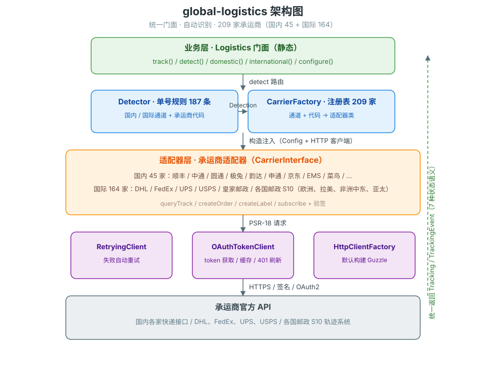
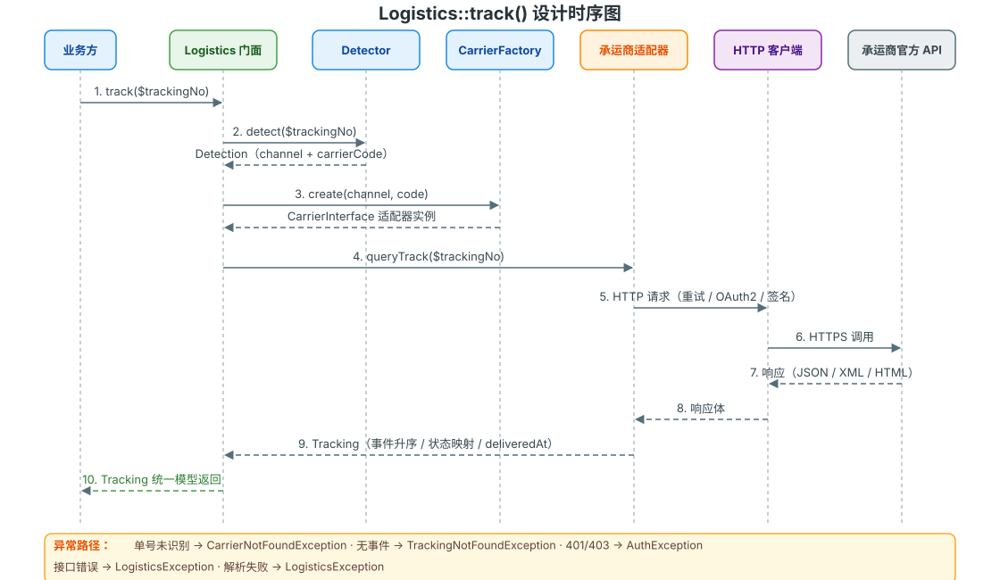

# global-logistics

统一门面的国内快递 / 国际物流轨迹查询 composer 包（PHP 8.2+，PSR-4，不绑定框架）。

## 项目介绍

**global-logistics** 把全球 **209 家**快递 / 邮政承运商的轨迹查询统一收敛为一个门面：业务方只需传入单号，自动识别国内 / 国际通道与承运商，无需关心各家协议差异（签名、OAuth2、XML/JSON、状态映射）。

| 指标 | 数值 |
|---|---|
| 已接入承运商 | **209 家**（国内 45 + 国际 164） |
| 单号自动识别规则 | 187 条（顺序敏感，优先命中） |
| 国际覆盖 | 四大快递（DHL / FedEx / UPS / USPS）+ 各国邮政 S10（欧洲、拉美加勒比、非洲中东、亚太四区域） |
| 统一状态语义 | `TrackStatus` 7 种（含异常 / 退回） |
| 测试 | 1663 个用例 / 6662 断言，全绿 |
| 环境 | PHP 8.2+、PSR-4 / PSR-18，无框架绑定，Laravel / ThinkPHP / Hyperf / Webman / Yii 2 即装即用 |

## 项目说明

面向电商、仓储、ERP 等业务系统，把「国内快递 + 国际物流」的官方 API 统一收敛为一个门面：

- **一条入口**：`Logistics::track($trackingNo)` 自动识别国内 / 国际通道与承运商，无需关心单号归属
- **一套数据模型**：所有承运商返回统一的 `Tracking` / `TrackingEvent` 结构，业务层只对接一种形状
- **一种状态语义**：承运商五花八门的原始状态映射为统一的 `TrackStatus` 枚举（7 种）
- **全球覆盖**：国际通道 164 家，含 DHL / FedEx / UPS / USPS 与各国邮政 S10 系统（欧洲、拉美加勒比、非洲中东、亚太四区域）
- **密钥零硬编码**：各家密钥全部经配置注入，代码与密钥完全分离

## 功能说明

### 已接入承运商（209 家）

| 通道 | 承运商 | 代码 | 轨迹查询 | 下单/面单/订阅 |
|---|---|---|---|---|
| 国内 | 顺丰 | `sf` | ✅ | 下单/面单/订阅按承运商开放情况接入中 |
| 国内 | 中通 | `zto` | ✅ | 同上 |
| 国内 | 圆通 | `yto` | ✅ | 同上 |
| 国内 | 极兔 | `jt` | ✅ | 同上 |
| 国内 | 韵达 | `yd` | ✅ | 同上 |
| 国内 | 申通 | `sto` | ✅ | 同上 |
| 国内 | 京东 | `jd` | ✅ | 同上 |
| 国内 | EMS | `ems` | ✅ | 同上 |
| 国内 | 百世 | `ht` | ✅ | 同上 |
| 国内 | 德邦 | `debon` | ✅ | 同上 |
| 国内 | 跨越 | `ky` | ✅ | 同上 |
| 国内 | 安能 | `ane` | ✅ | 同上 |
| 国内 | 菜鸟速递 | `cainiao` | ✅ | 同上 |
| 国内 | 中国邮政 | `china-post` | ✅ | 同上 |
| 国内 | 苏宁物流 | `suning` | ✅ | 同上 |
| 国内 | 优速 | `uc` | ✅ | 同上 |
| 国内 | 壹米滴答 | `ymd` | ✅ | 同上 |
| 国内 | 宅急送 | `zjs` | ✅ | 同上 |
| 国内 | 天天快递 | `tiantian` | ✅ | 同上 |
| 国内 | 中通快运 | `zto-freight` | ✅ | 同上 |
| 国内 | 丹鸟（菜鸟直送） | `dainiao` | ✅ | 同上 |
| 国内 | 中铁快运 | `cre` | ✅ | 同上 |
| 国内 | 顺心捷达 | `sxjd` | ✅ | 同上 |
| 国内 | 速尔 | `sure` | ✅ | 同上 |
| 国内 | 信丰物流 | `xf` | ✅ | 同上 |
| 国内 | 联昊通 | `lht` | ✅ | 同上 |
| 国内 | 日日顺 | `rrs` | ✅ | 同上 |
| 国内 | 丰网速运 | `fengwang` | ✅ | 同上 |
| 国内 | 百世快运 | `ht-freight` | ✅ | 同上 |
| 国内 | 韵达快运 | `yd-freight` | ✅ | 同上 |
| 国内 | 圆通快运 | `yto-freight` | ✅ | 同上 |
| 国内 | 增益速递 | `zy` | ✅ | 同上 |
| 国内 | 民航快递 | `cae` | ✅ | 同上 |
| 国内 | 天地华宇 | `huayu` | ✅ | 同上 |
| 国内 | 佳吉快运 | `jiaji` | ✅ | 同上 |
| 国内 | 龙邦速递 | `longbang` | ✅ | 同上 |
| 国内 | 全一快递 | `qy` | ✅ | 同上 |
| 国内 | 速腾物流 | `suteng` | ✅ | 同上 |
| 国内 | 中铁物流 | `zhongtie` | ✅ | 同上 |
| 国内 | 中邮物流 | `zhongyou` | ✅ | 同上 |
| 国内 | 增益速递 | `zengyi` | ✅ | 同上 |
| 国内 | 全峰快递 | `quanfeng` | ✅ | 同上 |
| 国内 | 国通快递 | `guotong` | ✅ | 同上 |
| 国内 | 远成快运 | `yuancheng` | ✅ | 同上 |
| 国内 | 新邦物流 | `xinbang` | ✅ | 同上 |
| 国际 | DHL | `dhl` | ✅（OAuth2） | 同上 |
| 国际 | FedEx | `fedex` | ✅（OAuth2） | 同上 |
| 国际 | UPS | `ups` | ✅（OAuth2） | 同上 |
| 国际 | USPS | `usps` | ✅ | 同上 |
| 国际 | 皇家邮政 | `royal-mail` | ✅（OAuth2） | 同上 |
| 国际 | 加拿大邮政 | `canada-post` | ✅ | 同上 |
| 国际 | 澳大利亚邮政 | `australia-post` | ✅ | 同上 |
| 国际 | 日本邮政 | `japan-post` | ✅（无认证） | 同上 |
| 国际 | Aramex | `aramex` | ✅ | 同上 |
| 国际 | GLS | `gls` | ✅ | 同上 |
| 国际 | DPD | `dpd` | ✅ | 同上 |
| 国际 | PostNL | `postnl` | ✅ | 同上 |
| 国际 | 菜鸟国际 | `cainiao-intl` | ✅ | 同上 |
| 国际 | 巴西邮政 | `correios` | ✅ | 同上 |
| 国际 | Evri | `evri` | ✅ | 同上 |
| 国际 | 递四方 | `fourpx` | ✅ | 同上 |
| 国际 | 香港邮政 | `hong-kong-post` | ✅ | 同上 |
| 国际 | 嘉里快递 | `kerry` | ✅ | 同上 |
| 国际 | 韩国邮政 | `korea-post` | ✅ | 同上 |
| 国际 | 法国邮政 | `la-poste` | ✅ | 同上 |
| 国际 | 新西兰邮政 | `nz-post` | ✅ | 同上 |
| 国际 | 意大利邮政 | `poste-italiane` | ✅ | 同上 |
| 国际 | 俄罗斯邮政 | `russia-post` | ✅ | 同上 |
| 国际 | 新加坡邮政 | `singapore-post` | ✅ | 同上 |
| 国际 | 瑞士邮政 | `swiss-post` | ✅（OAuth2） | 同上 |
| 国际 | Yodel | `yodel` | ✅（OAuth2） | 同上 |
| 国际 | 云途物流 | `yunexpress` | ✅ | 同上 |
| 国际 | 燕文物流 | `yanwen` | ✅ | 同上 |
| 国际 | 顺丰国际 | `sf-international` | ✅ | 同上 |
| 国际 | TNT | `tnt` | ✅ | 同上 |
| 国际 | ONTRAQ | `ontrac` | ✅ | 同上 |
| 国际 | Purolator | `purolator` | ✅ | 同上 |
| 国际 | bpost（比利时邮政） | `bpost` | ✅ | 同上 |
| 国际 | Correos（西班牙邮政） | `correos` | ✅ | 同上 |
| 国际 | Delhivery（印度） | `delhivery` | ✅ | 同上 |
| 国际 | InPost（波兰包裹柜） | `inpost` | ✅ | 同上 |
| 国际 | Omniva（爱沙尼亚） | `omniva` | ✅ | 同上 |
| 国际 | Posti（芬兰） | `posti` | ✅ | 同上 |
| 国际 | Bring（挪威） | `bring` | ✅ | 同上 |
| 国际 | 奥地利邮政 | `austrian-post` | ✅ | 同上 |
| 国际 | 泰国邮政 | `thailand-post` | ✅ | 同上 |
| 国际 | 中华邮政（台湾） | `chunghwa-post` | ✅ | 同上 |
| 国际 | PostNord（瑞典/丹麦） | `postnord` | ✅ | 同上 |
| 国际 | CTT（葡萄牙） | `ctt` | ✅ | 同上 |
| 国际 | An Post（爱尔兰） | `an-post` | ✅ | 同上 |
| 国际 | Poczta Polska（波兰） | `poczta-polska` | ✅ | 同上 |
| 国际 | India Post（印度） | `india-post` | ✅ | 同上 |
| 国际 | Pos Malaysia（马来西亚） | `pos-malaysia` | ✅ | 同上 |
| 国际 | Emirates Post（阿联酋） | `emirates-post` | ✅ | 同上 |
| 国际 | Magyar Posta（匈牙利） | `magyar-posta` | ✅ | 同上 |
| 国际 | Česká pošta（捷克） | `ceska-posta` | ✅ | 同上 |
| 国际 | ELTA（希腊） | `elta` | ✅ | 同上 |
| 国际 | Viettel Post（越南） | `viettel-post` | ✅ | 同上 |
| 国际 | 中通国际 | `zto-intl` | ✅ | 同上 |
| 国际 | 圆通国际 | `yto-intl` | ✅ | 同上 |
| 国际 | 极兔国际 | `jt-intl` | ✅ | 同上 |
| 国际 | 万邑通 | `winit` | ✅ | 同上 |
| 国际 | Ukrposhta（乌克兰） | `ukrposhta` | ✅ | 同上 |
| 国际 | Turkey PTT（土耳其） | `turkey-post` | ✅ | 同上 |
| 国际 | Israel Post（以色列） | `israel-post` | ✅ | 同上 |
| 国际 | Egypt Post（埃及） | `egypt-post` | ✅ | 同上 |
| 国际 | Saudi Post（沙特） | `saudi-post` | ✅ | 同上 |
| 国际 | South African Post（南非） | `south-african-post` | ✅ | 同上 |
| 国际 | Correos de México（墨西哥） | `correos-mexico` | ✅ | 同上 |
| 国际 | Correo Argentino（阿根廷） | `correo-argentino` | ✅ | 同上 |
| 国际 | Correos de Chile（智利） | `correos-chile` | ✅ | 同上 |
| 国际 | Pos Indonesia（印尼） | `pos-indonesia` | ✅ | 同上 |
| 国际 | PHLPost（菲律宾） | `phl-post` | ✅ | 同上 |
| 国际 | Pakistan Post（巴基斯坦） | `pakistan-post` | ✅ | 同上 |
| 国际 | Kazpost（哈萨克斯坦） | `kazpost` | ✅ | 同上 |
| 国际 | Poșta Română（罗马尼亚） | `romania-post` | ✅ | 同上 |
| 国际 | Hrvatska pošta（克罗地亚） | `croatia-post` | ✅ | 同上 |
| 国际 | Slovak Post（斯洛伐克） | `slovak-post` | ✅ | 同上 |
| 国际 | Pošta Slovenije（斯洛文尼亚） | `slovenia-post` | ✅ | 同上 |
| 国际 | Pošta Srbije（塞尔维亚） | `serbia-post` | ✅ | 同上 |
| 国际 | Bulgarian Posts（保加利亚） | `bulgaria-post` | ✅ | 同上 |
| 国际 | Lietuvos paštas（立陶宛） | `lithuania-post` | ✅ | 同上 |
| 国际 | Latvijas Pasts（拉脱维亚） | `latvia-post` | ✅ | 同上 |
| 国际 | Íslandspóstur（冰岛） | `iceland-post` | ✅ | 同上 |
| 国际 | MaltaPost（马耳他） | `malta-post` | ✅ | 同上 |
| 国际 | POST Luxembourg（卢森堡） | `luxembourg-post` | ✅ | 同上 |
| 国际 | Cyprus Post（塞浦路斯） | `cyprus-post` | ✅ | 同上 |
| 国际 | Poșta Moldovei（摩尔多瓦） | `moldova-post` | ✅ | 同上 |
| 国际 | Posta Shqiptare（阿尔巴尼亚） | `albania-post` | ✅ | 同上 |
| 国际 | Belpochta（白俄罗斯） | `belarus-post` | ✅ | 同上 |
| 国际 | Makedonska Pošta（北马其顿） | `macedonia-post` | ✅ | 同上 |
| 国际 | BH Pošta（波黑） | `bosnia-post` | ✅ | 同上 |
| 国际 | Deutsche Post（德国） | `deutsche-post` | ✅ | 同上 |
| 国际 | Montenegro Post（黑山） | `montenegro-post` | ✅ | 同上 |
| 国际 | Andorra Post（安道尔） | `andorra-post` | ✅ | 同上 |
| 国际 | La Poste Monaco（摩纳哥） | `monaco-post` | ✅ | 同上 |
| 国际 | Liechtenstein Post（列支敦士登） | `liechtenstein-post` | ✅ | 同上 |
| 国际 | Poste San Marino（圣马力诺） | `san-marino-post` | ✅ | 同上 |
| 国际 | Poste Vaticane（梵蒂冈） | `vatican-post` | ✅ | 同上 |
| 国际 | Royal Gibraltar Post（直布罗陀） | `gibraltar-post` | ✅ | 同上 |
| 国际 | Jersey Post（泽西） | `jersey-post` | ✅ | 同上 |
| 国际 | Guernsey Post（根西） | `guernsey-post` | ✅ | 同上 |
| 国际 | Isle of Man Post（马恩岛） | `isle-of-man-post` | ✅ | 同上 |
| 国际 | Posta Faroe Islands（法罗群岛） | `faroe-post` | ✅ | 同上 |
| 国际 | Post Greenland（格陵兰） | `greenland-post` | ✅ | 同上 |
| 国际 | Post Åland（奥兰群岛） | `aland-post` | ✅ | 同上 |
| 国际 | 4-72（哥伦比亚） | `colombia-post` | ✅ | 同上 |
| 国际 | Serpost（秘鲁） | `peru-post` | ✅ | 同上 |
| 国际 | Correo Uruguayo（乌拉圭） | `uruguay-post` | ✅ | 同上 |
| 国际 | Correo Paraguayo（巴拉圭） | `paraguay-post` | ✅ | 同上 |
| 国际 | Correos de Bolivia（玻利维亚） | `bolivia-post` | ✅ | 同上 |
| 国际 | Correos del Ecuador（厄瓜多尔） | `ecuador-post` | ✅ | 同上 |
| 国际 | Ipostel（委内瑞拉） | `venezuela-post` | ✅ | 同上 |
| 国际 | Correos de Costa Rica（哥斯达黎加） | `costa-rica-post` | ✅ | 同上 |
| 国际 | Correos de Panamá（巴拿马） | `panama-post` | ✅ | 同上 |
| 国际 | INPOSDOM（多米尼加） | `dominican-post` | ✅ | 同上 |
| 国际 | Correo de Guatemala（危地马拉） | `guatemala-post` | ✅ | 同上 |
| 国际 | HonduCorreo（洪都拉斯） | `honduras-post` | ✅ | 同上 |
| 国际 | Correos de El Salvador（萨尔瓦多） | `el-salvador-post` | ✅ | 同上 |
| 国际 | Correos de Nicaragua（尼加拉瓜） | `nicaragua-post` | ✅ | 同上 |
| 国际 | Correos de Cuba（古巴） | `cuba-post` | ✅ | 同上 |
| 国际 | Jamaica Post（牙买加） | `jamaica-post` | ✅ | 同上 |
| 国际 | TTPOST（特立尼达和多巴哥） | `trinidad-post` | ✅ | 同上 |
| 国际 | Barbados Post（巴巴多斯） | `barbados-post` | ✅ | 同上 |
| 国际 | Bahamas Post（巴哈马） | `bahamas-post` | ✅ | 同上 |
| 国际 | Suriname Post（苏里南） | `suriname-post` | ✅ | 同上 |
| 国际 | Guyana Post（圭亚那） | `guyana-post` | ✅ | 同上 |
| 国际 | Barid Al-Maghrib（摩洛哥） | `morocco-post` | ✅ | 同上 |
| 国际 | Algérie Poste（阿尔及利亚） | `algeria-post` | ✅ | 同上 |
| 国际 | La Poste Tunisienne（突尼斯） | `tunisia-post` | ✅ | 同上 |
| 国际 | Posta Kenya（肯尼亚） | `kenya-post` | ✅ | 同上 |
| 国际 | NIPOST（尼日利亚） | `nigeria-post` | ✅ | 同上 |
| 国际 | Ethiopia Post（埃塞俄比亚） | `ethiopia-post` | ✅ | 同上 |
| 国际 | Ghana Post（加纳） | `ghana-post` | ✅ | 同上 |
| 国际 | Tanzania Post（坦桑尼亚） | `tanzania-post` | ✅ | 同上 |
| 国际 | Uganda Post（乌干达） | `uganda-post` | ✅ | 同上 |
| 国际 | Rwanda Post（卢旺达） | `rwanda-post` | ✅ | 同上 |
| 国际 | Zampost（赞比亚） | `zambia-post` | ✅ | 同上 |
| 国际 | Zimpost（津巴布韦） | `zimbabwe-post` | ✅ | 同上 |
| 国际 | Mozambique Post（莫桑比克） | `mozambique-post` | ✅ | 同上 |
| 国际 | Correios de Angola（安哥拉） | `angola-post` | ✅ | 同上 |
| 国际 | La Poste Sénégalaise（塞内加尔） | `senegal-post` | ✅ | 同上 |
| 国际 | La Poste de Côte d'Ivoire（科特迪瓦） | `ivory-coast-post` | ✅ | 同上 |
| 国际 | Cameroon Post（喀麦隆） | `cameroon-post` | ✅ | 同上 |
| 国际 | Mauritius Post（毛里求斯） | `mauritius-post` | ✅ | 同上 |
| 国际 | Qatar Post（卡塔尔） | `qatar-post` | ✅ | 同上 |
| 国际 | Kuwait Post（科威特） | `kuwait-post` | ✅ | 同上 |
| 国际 | Bahrain Post（巴林） | `bahrain-post` | ✅ | 同上 |
| 国际 | Bangladesh Post（孟加拉） | `bangladesh-post` | ✅ | 同上 |
| 国际 | Nepal Post（尼泊尔） | `nepal-post` | ✅ | 同上 |
| 国际 | Sri Lanka Post（斯里兰卡） | `sri-lanka-post` | ✅ | 同上 |
| 国际 | Myanmar Post（缅甸） | `myanmar-post` | ✅ | 同上 |
| 国际 | Cambodia Post（柬埔寨） | `cambodia-post` | ✅ | 同上 |
| 国际 | Laos Post（老挝） | `laos-post` | ✅ | 同上 |
| 国际 | Mongolia Post（蒙古） | `mongolia-post` | ✅ | 同上 |
| 国际 | Georgian Post（格鲁吉亚） | `georgia-post` | ✅ | 同上 |
| 国际 | Azərpoçt（阿塞拜疆） | `azerbaijan-post` | ✅ | 同上 |
| 国际 | HayPost（亚美尼亚） | `armenia-post` | ✅ | 同上 |
| 国际 | Uzbekistan Post（乌兹别克斯坦） | `uzbekistan-post` | ✅ | 同上 |
| 国际 | Kyrgyz Post（吉尔吉斯斯坦） | `kyrgyzstan-post` | ✅ | 同上 |
| 国际 | Tajikistan Post（塔吉克斯坦） | `tajikistan-post` | ✅ | 同上 |
| 国际 | Turkmenistan Post（土库曼斯坦） | `turkmenistan-post` | ✅ | 同上 |
| 国际 | Afghanistan Post（阿富汗） | `afghanistan-post` | ✅ | 同上 |
| 国际 | Bhutan Post（不丹） | `bhutan-post` | ✅ | 同上 |
| 国际 | Maldives Post（马尔代夫） | `maldives-post` | ✅ | 同上 |
| 国际 | Brunei Post（文莱） | `brunei-post` | ✅ | 同上 |
| 国际 | Papua New Guinea Post（巴布亚新几内亚） | `papua-post` | ✅ | 同上 |
| 国际 | Fiji Post（斐济） | `fiji-post` | ✅ | 同上 |
| 国际 | Samoa Post（萨摩亚） | `samoa-post` | ✅ | 同上 |

### 统一状态枚举（`GlobalLogistics\Support\TrackStatus`）

`PENDING`（待揽收）→ `IN_TRANSIT`（运输中）→ `OUT_FOR_DELIVERY`（派送中）→ `DELIVERED`（已签收）；异常归 `EXCEPTION`，退回归 `RETURNED`，无法识别归 `UNKNOWN`。

### 核心能力

- 单号自动检测（187 条正则规则，顺序敏感，优先命中国内规则）
- 统一轨迹查询（`Logistics::track()`）与显式通道调用（`domestic()` / `international()`）
- 统一异常体系（认证失败 / 单号不存在 / 网络错误 / 承运商未注册 / 接口错误）
- HTTP 基础设施：PSR-18 客户端、OAuth2 token 自动获取与缓存、失败自动重试
- 框架自动发现：Laravel / ThinkPHP 8 / Hyperf / Webman / Yii 2 即装即用
- 回调签名验证（顺丰示例：`verifyCallbackSignature()`）

## 使用说明

### 安装

```bash
composer require erikwang2013/global-logistics
```

### 配置

```php
<?php

use GlobalLogistics\Logistics;

Logistics::configure([
    // 国内
    'sf' => ['partner_id' => '...', 'checkword' => '...'],
    'zto' => ['company_id' => '...', 'secret' => '...'],
    'yto' => ['app_key' => '...', 'app_secret' => '...'],
    'jt' => ['api_key' => '...', 'secret' => '...'],
    'yd' => ['app_key' => '...', 'app_secret' => '...'],
    'sto' => [],
    'jd' => [],
    'ems' => ['app_id' => '...'],
    'ht' => ['partner_id' => '...', 'token' => '...'],
    'debon' => ['app_key' => '...', 'app_secret' => '...'],
    'ky' => ['app_key' => '...', 'app_secret' => '...'],
    'ane' => ['app_key' => '...'],
    // 国际
    'dhl' => ['client_id' => '...', 'client_secret' => '...'],
    'fedex' => ['client_id' => '...', 'client_secret' => '...'],
    'ups' => ['client_id' => '...', 'client_secret' => '...'],
    'usps' => ['user_id' => '...'],
    'royal-mail' => ['client_id' => '...', 'client_secret' => '...'],
    'canada-post' => ['customer_number' => '...', 'api_key' => '...'],
    'australia-post' => ['api_key' => '...'],
    'japan-post' => [],
    'aramex' => ['user_name' => '...', 'password' => '...', 'account_number' => '...'],
    'gls' => ['api_key' => '...'],
    'dpd' => ['user_name' => '...', 'password' => '...'],
    'postnl' => ['api_key' => '...'],

    // 可选：自定义 PSR-18 HTTP 客户端（默认自动构建 Guzzle）
    'http_client' => null,
    // 可选：失败重试次数（默认 2）
    'max_retries' => 2,
]);
```

> 框架项目（Laravel 等）可直接使用 `config/logistics.php` 模板，见「框架集成」。

### 查询轨迹

```php
// 自动识别通道（国内/国际）与承运商
$tracking = Logistics::track('SF1234567890');

// 显式指定（单号规则无法覆盖时）
$tracking = Logistics::domestic('sf')->queryTrack('SF1234567890');
$tracking = Logistics::international('dhl')->queryTrack('DHL1234567890');

echo $tracking->status->name;       // DELIVERED
echo $tracking->latestDescription;  // 快件已签收
echo $tracking->carrierCode;        // sf
echo $tracking->deliveredAt?->format('Y-m-d H:i:s');  // 签收时间（已签收时）

foreach ($tracking->events as $event) {
    echo $event->occurredAt?->format('Y-m-d H:i:s'), ' ', $event->location, ' ', $event->description, PHP_EOL;
}
```

### 错误处理

所有异常继承 `GlobalLogistics\Exceptions\LogisticsException`，可统一捕获：

| 异常 | 场景 |
|---|---|
| `CarrierNotFoundException` | 单号无法识别承运商 |
| `TrackingNotFoundException` | 单号合法但承运商查无轨迹 |
| `AuthException` | 认证失败（密钥错误等） |
| `NetworkException` | HTTP 网络错误（实现 PSR-18 `NetworkExceptionInterface`） |
| `LogisticsException` | 其他接口/解析错误 |

```php
use GlobalLogistics\Exceptions\LogisticsException;

try {
    $tracking = Logistics::track('SF1234567890');
} catch (LogisticsException $e) {
    // 记录 $e->getMessage()，其中含承运商代码与原始错误码，如 "[SF A1001] 必传参数不可为空"
}
```

### 回调验签（订阅推送）

承运商开放订阅接口后，回调处理示例（以顺丰为例）：

```php
use GlobalLogistics\Logistics;

$carrier = Logistics::domestic('sf');
if (!$carrier->verifyCallbackSignature((string) file_get_contents('php://input'), (string) $_SERVER['HTTP_DIGEST'])) {
    http_response_code(401);
    exit('signature mismatch');
}
// 验签通过，处理轨迹推送……
```

## 架构设计





### 目录结构

```
global-logistics/
├── src/
│   ├── Carriers/
│   │   ├── Domestic/          # 国内 45 家适配器（顺丰、中通、圆通、…）
│   │   └── International/     # 国际 164 家适配器（DHL、FedEx、UPS、各国邮政 S10、…）
│   ├── Exceptions/            # 异常体系（LogisticsException + 4 个细分场景异常）
│   ├── Framework/             # 框架自动发现（Laravel / ThinkPHP / Hyperf / Webman / Yii 2）
│   ├── Http/                  # PSR-18：OAuthTokenClient、RetryingClient、HttpClientFactory
│   ├── Models/                # Tracking / TrackingEvent / Order / OrderRequest / Label
│   ├── Resources/             # carrier-registry.php（209 家注册表）、detector-rules.php（187 条规则）
│   ├── Support/               # TrackStatus 等支持类
│   ├── CarrierFactory.php     # 注册表 → 适配器实例化
│   ├── CarrierInterface.php   # 适配器统一契约
│   ├── Channel.php            # 国内 / 国际通道枚举
│   ├── Config.php             # 点号键配置读取
│   ├── Detection.php          # 单号检测结果
│   ├── Detector.php           # 单号规则检测
│   ├── Install.php            # 安装引导
│   └── Logistics.php          # 静态门面
├── config/
│   └── logistics.php          # 配置模板（209 家密钥占位）
├── docs/
│   ├── images/                # 架构图 / 设计时序图
│   └── superpowers/           # 设计规格与实施计划
├── tests/
│   ├── Carriers/              # 每承运商 7 个用例（共 539 个）
│   ├── Unit/                  # 检测器、注册表冒烟等
│   └── fixtures/              # 每家 track / empty / error 夹具
├── composer.json
└── README.md
```

### 各层职责

- **`Logistics`**（`src/Logistics.php`）：静态门面，持有全局配置、检测器与工厂；未配置时自动以空配置初始化
- **`Detector`**（`src/Detector.php` + `src/Resources/detector-rules.php`）：正则规则表按顺序首次命中，返回 `Detection`（通道 + 承运商代码）；规则顺序敏感（如 77 开头申通须先于纯 13 位数字规则）
- **`CarrierFactory`**（`src/CarrierFactory.php` + `src/Resources/carrier-registry.php`）：按「通道 → 代码 → 适配器类」注册表实例化适配器，统一注入 `Config` 与 HTTP 客户端
- **承运商适配器**（`src/Carriers/`）：实现 `CarrierInterface`，负责各家协议差异（签名、OAuth2、XML/JSON、状态映射）；同一模板结构（`ENDPOINT` 常量 + `STATUS_MAP` + `mapEvent()`），便于按模板新增承运商
- **HTTP 层**（`src/Http/`）：`OAuthTokenClient` 为 PSR-18 装饰器，懒获取 token、进程内缓存（提前 60s 过期）、401 时刷新重试一次；`RetryingClient` 按 `max_retries` 重试失败请求
- **模型层**（`src/Models/`）：`Tracking` / `TrackingEvent` 为不可变对象；`Order` / `OrderRequest` / `Label` 为下单、面单能力预留
- **`Config`**（`src/Config.php`）：点号键取值（`$config->get('dhl.client_id')`）
- **异常体系**（`src/Exceptions/`）：`LogisticsException` 为基类，细分 4 个场景异常

### 扩展新承运商

1. 新建适配器类（参照 `src/Carriers/Domestic/Yto.php` 模板）：实现 `CarrierInterface`，在 `mapEvent()` 中做状态映射
2. 注册表：`src/Resources/carrier-registry.php` 增加「通道 → 代码 → 类」
3. 单号规则：`src/Resources/detector-rules.php` 增加正则（注意顺序敏感，国内规则优先）
4. 补 fixture 与适配器测试（mock HTTP，无需真实密钥）

## 框架集成

`composer require erikwang2013/global-logistics` 后按框架自动发现，无需手工注册；配置模板统一为承运商代码为顶层键的数组（见 `config/logistics.php`，结构与 `Logistics::configure()` 入参一致）。

### Laravel

- 自动注册：composer `extra.laravel.providers` 包发现，无需配置
- 发布配置：`php artisan vendor:publish --tag=global-logistics`（生成 `config/logistics.php`）
- 使用：`\GlobalLogistics\Logistics::track('SF1234567890')`

### ThinkPHP 8

- 自动注册：composer `extra.think.services`（安装时生成 `vendor/services.php`，也可 `php think service:discover` 重新生成）
- 配置：应用 `config/logistics.php` 返回同结构数组（覆盖包内默认值）
- 使用：`\GlobalLogistics\Logistics::track('SF1234567890')`

### Hyperf

- 自动发现：composer `extra.hyperf.config` 指向 ConfigProvider
- 发布配置：`php bin/hyperf.php vendor:publish`（发布到 `config/autoload/logistics.php`）
- 使用：`\GlobalLogistics\Logistics::track('SF1234567890')`

### Webman

- 自动安装：webman 项目模板自带 `post-package-install` 等 composer 钩子，安装/更新时自动把配置拷贝到 `config/plugin/erikwang2013/global-logistics/`，卸载时自动删除
- 读取配置：`config('plugin.erikwang2013.global-logistics.app.sf.partner_id')`
- 使用：`\GlobalLogistics\Logistics::track('SF1234567890')`

### Yii 2

- 自动注册：包类型 `yii2-extension` + composer `extra.bootstrap`，应用每次引导时执行
- 配置：应用配置 `params` 中加 `'logistics' => [...同结构数组...]`
- 使用：`\GlobalLogistics\Logistics::track('SF1234567890')`
- 若 `vendor/yiisoft/extensions.php` 未出现本包条目（罕见），运行 `composer dump-autoload` 重建

## 开发

```bash
composer install
composer test
```

无需真实密钥即可跑全量测试（适配器测试走 mock HTTP + fixture；框架集成测试使用真实框架类）。
